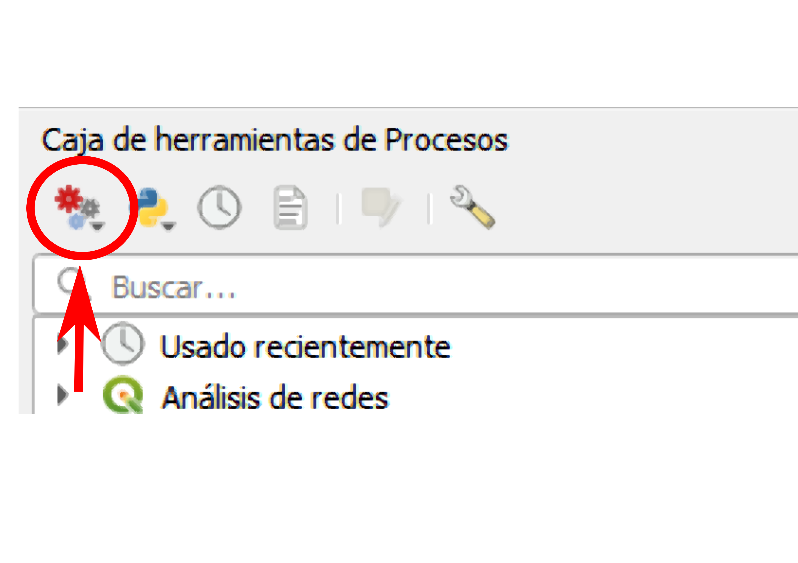
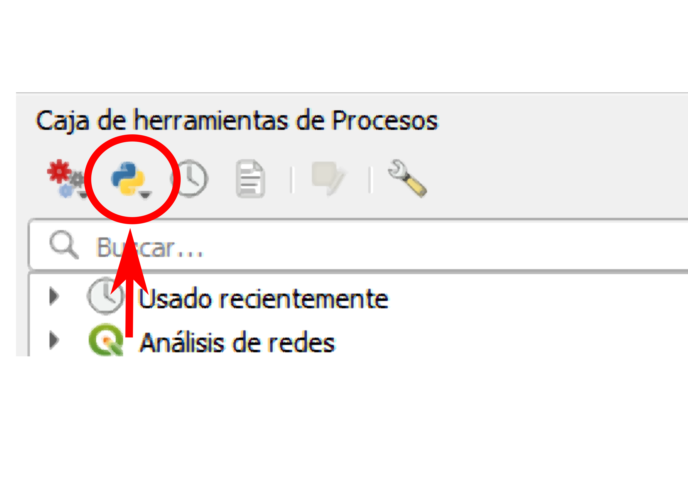

# FaultAnalysis
Several QGIS Tools and Algorithms for Fault Analysis

# WARNING
Some importat Errors on these scripts were detected!!. For the momment do not use them!!!

## How To add these scripts to your QGIS installation

There are two ways to add these scritps to your QGIS installtion. 
One is by locating the QGIS script folder in your disk and put all these scripts there, 
the other is by loading them using the Tool Box Menu.

### Tool Box Menu Procedure
1. Open Tool Box   
   Go to these menues -> See->Panels->Tool Box
2. When the Tool Box panel is open add your Model Scripts
3. Go to Model Icon->Add Model to the ToolBox
   
  
   
Models have extension .model3
   
5. Select your models and add them to your QGIS installation
6. Then add your Python scripts
   
   

Python scripts have .py extension
   
8. Go to Python Icon->Add Scripts to your Tool Box
9. Voila!!

## FaultSegmentAz.model3
Explode fault linestring segments and calculate their azimuth as data preparation for and orientation analysis and using in a line direction histogram.

## FractureAnalysisDensity.model3
Calculation of fracture density is defined as the number of fractures per unit of area enumerated in terms of unique points, as fracture centers, using hexagons as a sample window (based partially on Mauldon, 1998; Mauldon and Dershowitz, 2000 )

## FractureAnalysisDensityCircularWindow.model3
Calculation of fracture density as defined by Mauldon (1998)  defined as the sum of fractures longitud per unit of area using circular windows (based on Mauldon, 1998; Mauldon and Dershowitz, 2000 )

## FractureAnalysisIntensity.model3
Calculation of fracture intensity as defined by Mauldon (1998)  defined as the sum of fractures longitud per unit of area using hexagons as a sample window (based partially on Mauldon, 1998; Mauldon and Dershowitz, 2000 )

## FractureAnalysisIntensityCircularWindow.model3
Calculation of fracture intensity as defined by Mauldon (1998)  defined as the sum of fractures longitud per unit of area using circular windows (based on Mauldon, 1998; Mauldon and Dershowitz, 2000 )

## FractureConnectivityNodes.model3
Generate a point layer detecting X Y I fault nodes.

ToDo: Detect E (external or boundary) not valid nodes.

## lineamentDensityGrid.py
A simple method for calculation of a lineament density grid based on total lengths of lineaments inside of each cell. 

## lineamentDensityHeatMap.model3
Lineament density map based on extracting points along each lineament and using them for producing a density map by Heat Map algorithm (Asato, 2022)

## lineamentIntersections.model3
Lineament intersections detection. Produce a point layer. This is a clone of native:lineintersections QGIS algorithm. 

## lineamentParamCalc.py
Calculation of lineamet length, azimuth and orientation by quadrants
