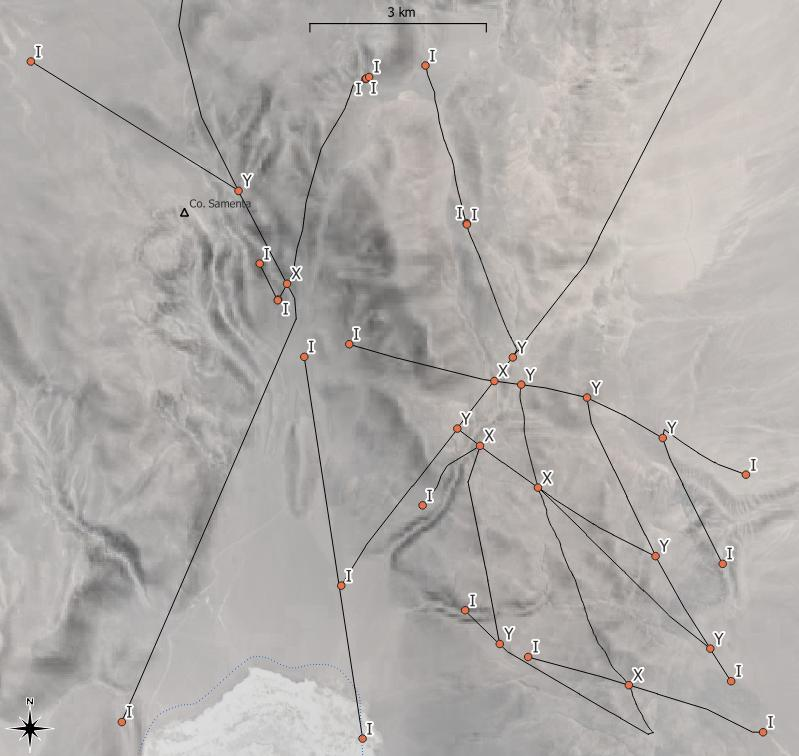
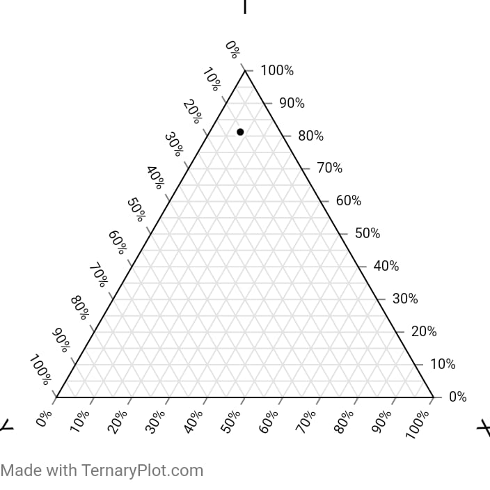
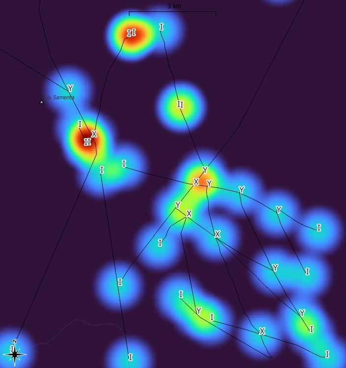
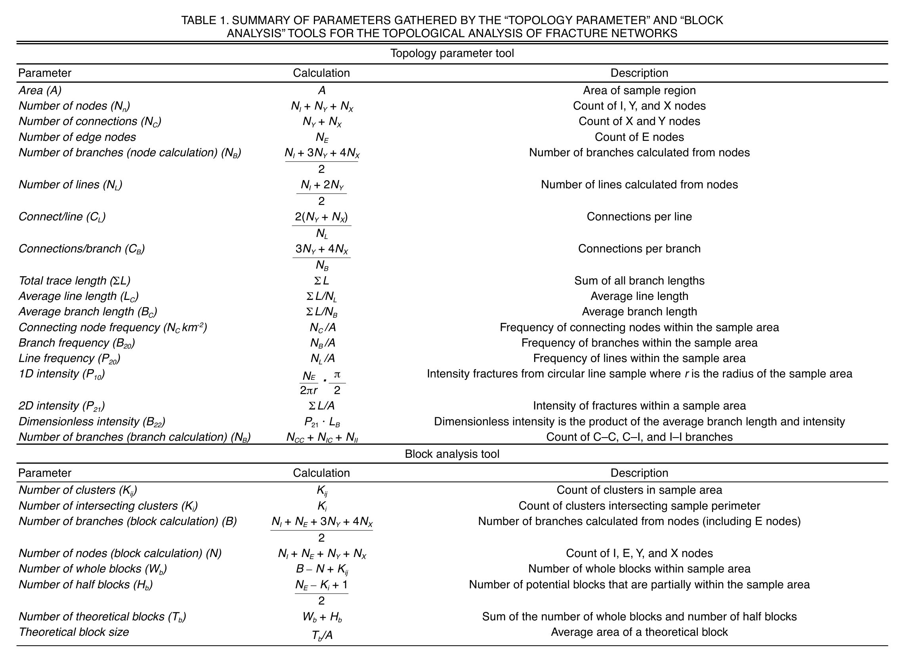

# Table of Contents
1. [XYI Fault Intersections Detection](#XYIFaultIntersectionsDetection)
2. [Network Topological Parameters](#NetworkTopologicalParameters)

<a id="XYIFaultIntersectionsDetection" />

# XYI Fault Intersections Detection

Based on Manzocchi (2002)

## Preliminar SQL-MM Workflow and Code

1. Fault traces must be digitized in a arc-node topology fashion. That means fault intersections must be recognized and we cannot have
  undershoots or overshoots with dangling nodes.

2. Recognize nodes

```
  select distinct geometry  from 
  (
    select endpoint(geometry) geometry from <faultLayer>
  union
    select startpoint(geometry) geometry from <faultLayer>
  )

```
3. Save resulting node layer (nodeLayer)
4. Detection of Fault-Node Intersections

```
  select  b.geometry geometry, b.fid, a.pk_UID, count(*) n_arcs,
    case
	    when count(*) = 1 THEN 'I'
	    when count(*) = 2 THEN ''
	    when count(*) = 3 THEN 'Y'
	    when count(*) >= 4 THEN 'X'
    end
  as nodeType 
  from <faultLayer> as a, <nodeLayer> as b
	where touches(b.geometry, a.geometry)
	group by b.fid order by b.fid

```

This code will work if an unique identifier is selected both for fault layer and node layer.

5. Save resulting node type layer (nodeTypeLayer)

## Expected Map Result 

.

## Connectivity Triangular Diagram

```
select  nodeType, count(*) from <nodeTypeLayer> group by nodetype
```
IYX

.

To be done!!

## Density Map of I and XY

It is suggested to use Heat Map Tools, until something more analytical tools will be implemented.

.


## References
Manzocchi, T. 2002. The connectivity of two-dimensional networks of spatially 
correlated fractures. Water Resources Research, 38 (9), pp 1162.

<a id="NetworkTopologicalParameters" />

# Network Topological Parameters
.

Table taken from: Nyberg, B., Nixon, C.W., Sanderson, D.J. (2018). NetworkGT: A GIS tool for geometric and topological analysis of two-dimensional fracture networks. _Geosphere, 14_(4).
